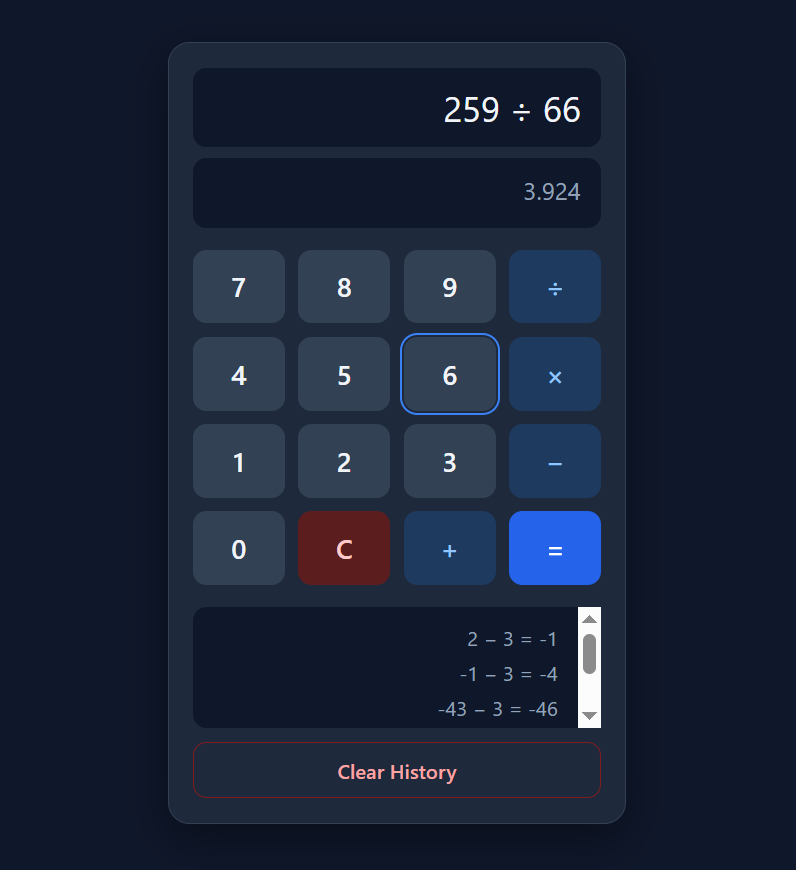

# Calculator + History 🧮

A simple calculator built with **HTML, CSS, and Vanilla JavaScript**.

Perform basic arithmetic calculations, see live results while typing, use keyboard input, and keep your calculation history even after refreshing the page.

---

## Features

* ➕ Addition
* ➖ Subtraction
* ✖️ Multiplication
* ➗ Division
* ⚡ Live calculation result
* ⌨️ Keyboard support using the `Enter` key
* 🧹 Clear current calculation
* 📜 Calculation history
* 💾 Saves calculation history using `localStorage`
* 🔄 History persists after page refresh
* ❌ Clear calculation history
* ⚠️ Handles incomplete and invalid expressions

---

## Tech Used

* HTML
* CSS
* JavaScript (Vanilla)
* DOM Manipulation
* LocalStorage
* JavaScript `eval()`

---

## How to Run

1. Clone the repo

```bash
git clone YOUR_REPOSITORY_URL
```

2. Open the project folder.
3. Open `index.html` in your browser.

---

## Screenshot



---

## Live Demo

[Click Here](https://piyushdhakad001.github.io/js-calculator/)

---

## What I Practiced

* DOM manipulation
* Event handling
* Keyboard events
* Arrays and objects
* Functions
* Conditional logic
* Error handling with `try...catch`
* Working with `localStorage`
* Converting user input into JavaScript expressions
* Dynamically rendering calculation history
* Persisting data between browser sessions

---

## Future Improvements

* Add percentage calculations
* Add parentheses support
* Add more advanced mathematical operations
* Improve expression validation
* Replace `eval()` with a safer expression parser

---

Made by **Piyush** 🚀

